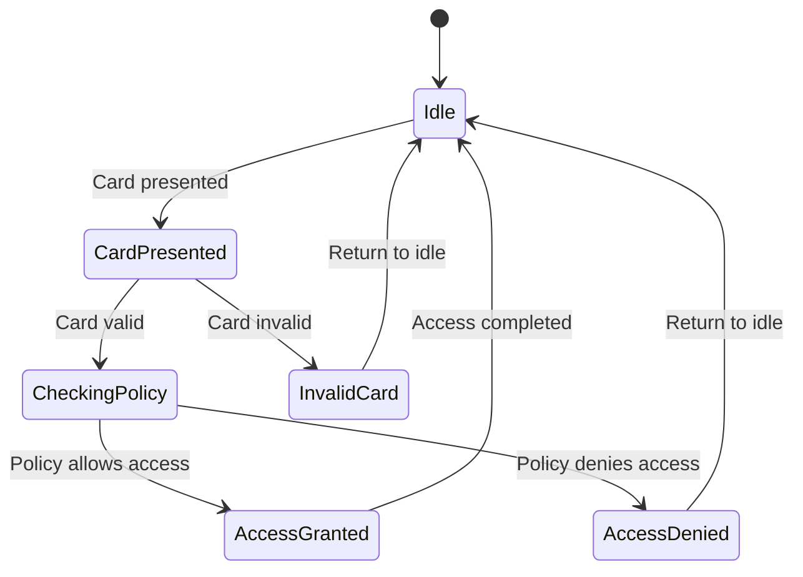

# DII-GEN6-CompoundSEC

This is project-based learning for CAMT-DII gen6 students

We will incrementally utilze OOP concept to develop the security system for a compound (resident buildings).
The importances of the project is allow student to do

1. Self-learning: read the related course materials in advance of lecture and learn to associate concept of lecture to the actual code using issue on Github
2. Backlog refinement: with question from self-learning, student must draft the issue on the backlog of current iteration. This draft of backlog will be discussed in class.
3. Dev-ready card: at the end of lecture session, student should clear all issues with lecturer and TA to fully understand the cost and process to move the card to ready tag.
4. In progress and In review: are tags that allow lecturer and TA to consult and review with student on the lab session.
5. Done: after reviewed, student can move the issues to the done tag to conclude the finished task on the current iteration.

**Backlog refinement** is the important step for student. The backlog can only create by student who did the self-study and develop the project to some extend.

## Design Brief

1. Access control system for multi-floor system (low floor, medium floor, high floor)
    - Access cards with multi-facades id and time-based encryption
    - Floor level access control and room level access control
2. Audit trial for card access
    - Each attempts will be logged with necessary info
    - Card generation or modification will be logged with necessary info
3. Card management
    - Add, modify, revoke permission of each card

## Finite State Machine for Access Control

The access control system will be redesigned to incorporate a finite state machine (FSM). This FSM will model the different states of an access request and the transitions between them, providing a more structured approach to access control.

**States:**

- **Idle:** Waiting for an access request.
- **CardPresented:** An access card has been presented.
- **CheckingPolicy:** The system is validating the card against the applicable access policy.
- **AccessGranted:** Access is granted.
- **AccessDenied:** Access is denied.
- **InvalidCard:** The presented card is invalid.

**Transitions:**

- Card presented.
- Card validation result (valid/invalid).
- Policy check result (allowed/denied).
- Access completion.

**Mermaid State Diagram:**



## Quick Start

1. Download the latest release from GitHub releases.
2. Unzip the downloaded package to your desired location.
3. Double-click `launch.bat` to start the application.

## Distribution Package

- The release package is located in `app/build/distributions/app.zip`.
- This ZIP file contains all necessary dependencies to run the application.

### Launch Script

- `launch.bat` is provided for easy startup on Windows.
- It directly executes the JAR file and pauses at the end.

```mermaid
graph LR
    Unauthorized -- Request Access --> Pending
    Pending -- Access Granted --> Authorized
    Pending -- Access Denied --> Unauthorized
    Authorized -- Access Revoked --> Unauthorized
    Authorized -- Timeout --> Unauthorized
    Unauthorized -- Card Presented --> IdentifyCard
    IdentifyCard -- Valid Card --> CheckPermissions
    IdentifyCard -- Invalid Card --> Unauthorized
    CheckPermissions -- Permissions Granted --> Authorized
    CheckPermissions -- Permissions Denied --> Unauthorized
    Pending -- Cancel Request --> Unauthorized
